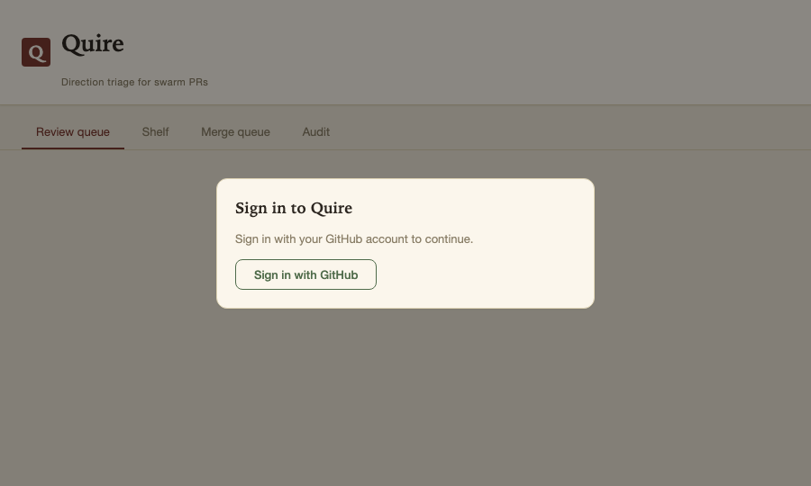
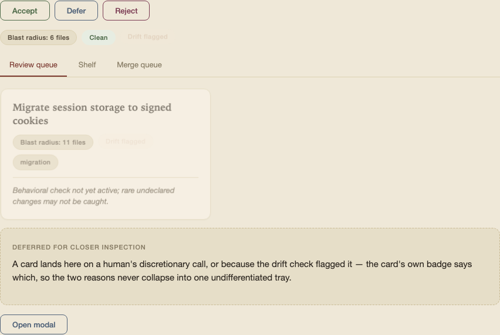

# Quire

Direction-triage for swarm PRs.

A *quire* is a gathered set of leaves bound together — the unit this product operates on: a bundle of PRs gathered by shared direction. (Pronounced like "choir"; favor the written form where the spelling matters.)

---

## What it does

Coding-agent swarms produce PRs faster than humans can review them. The bottleneck is not correctness — CI and the agents' own loops handle that. The bottleneck is **directional decisions**: a human deciding whether a feature goes the right way for the product.

Quire buys back that time by grouping PRs that pursue the same product direction into a **bundle**. The human makes one directional decision per bundle — accept, defer, or reject — instead of one per PR.

The value proposition rests on a single bargain: the human stops checking correctness and checks only direction. That bargain is only safe when the bundle's stated direction is an honest description of what every PR in it actually does. The drift-detection system (see `docs/engineering-handoff.md`) is what guards that honesty.

---

## Getting started

```bash
npm install
```

Quire needs a GitHub App registered before it will boot — see [GitHub App setup](#github-app-setup) below for the exact permissions/events/URLs. Once you have one:

```bash
cp .env.example .env   # fill in the values .env.example describes
npm run dev
```

This serves the UI and API at `http://localhost:3000` (override with `PORT`). Sign in with GitHub, install the App from Settings (gear icon in the header), then select a repo to start triaging its PRs.



---

## Gestures

| Swipe | Action | Effect |
|-------|--------|--------|
| Right | Accept | Enqueues bundle to merge queue — reversible until landed |
| Left  | Reject | Discards bundle — swarm regenerates |
| Down  | Defer  | Shelves for closer inspection — does not break triage rhythm |



*This is the actual review-card component and CSS, rendered from the design-system reference page rather than a live queue — a populated queue looks the same, with a real bundle's direction summary and blast radius in place of the sample text.*

---

## What Quire is not

- Not a code-review UI. A reviewer reading 800 lines of diff has defeated the purpose.
- Not a correctness checker. If the upstream generation pipeline cannot be trusted for correctness, Quire is the wrong tool.
- Not a decision-maker. It surfaces signal; the human's gesture is the router.

---

## GitHub App setup

Quire authenticates against GitHub as a GitHub App, not a personal access token. You need one registered before `npm run dev` will start — it refuses to boot without the env vars below (see `.env.example` for the full, authoritative list of vars and inline notes on which ones are dev-only vs. required for a public deployment).

1. **Create the App** at [github.com/settings/apps/new](https://github.com/settings/apps/new) (use an org's settings page instead of your personal one if you want the App owned by an org).
2. **Permissions** — under "Repository permissions", grant:
   - **Pull requests**: Read & write (reading PRs/diffs; write is needed to merge a landed bundle, close a rejected PR, and mark a draft ready for review before merging)
   - **Contents**: Read & write (reading diffs; write is needed to create the merge commit and the revert commit)
   - **Issues**: Read & write (Quire posts a review-card comment on every gesture — accept, defer, or reject — via the Issues API, which PR comments go through)
   - **Administration**: Read & write (required to add/remove GitHub collaborators on a team's bound repos when someone joins/leaves the Quire team)
   - **Checks**: Read-only (required to receive the `check_suite` webhook event a blocked-on-CI queue entry needs to self-heal once checks go green, without waiting for a push)
   - **Metadata**: Read-only (mandatory default, selected automatically)

   If you upgrade an already-installed App's permissions later, GitHub requires the installation to accept the new permission set before write calls will succeed — for a personal install that's a one-click prompt on the app's page or in your notifications; for an org install, an org owner must approve it. If you installed Quire before the Administration permission was added, your existing installation must re-approve it the same way before team-membership changes will sync GitHub collaborators — until then, joins/leaves/removals still succeed on the Quire side, but the matching GitHub collaborator add/remove is skipped and logged as a permission error.
3. **Webhook** — check "Active" and subscribe to the **Pull request** event (covers opened/synchronize/edited/closed and draft-state changes, which drive Quire's queue updates between reconcile polls — `edited` is what updates the queue when a still-undecided PR's declared-direction marker is fixed after opening; an already-decided PR only returns on a new push), the **Check suite** event (lets a bundle blocked on failing/pending checks self-heal once CI goes green), and the **Pull request review** event (lets a bundle blocked on a missing required review self-heal once it's approved) — all three feed the same queue re-diagnosis, just on different GitHub-side signals, so a badge's conflict/blocked/unstable kind doesn't go stale waiting for someone to notice and click Retry. The Webhook URL must be a real address GitHub's servers can reach — for local dev, point it at a [smee.io](https://smee.io) channel (`npx smee -u https://smee.io/<channel> -t http://localhost:3000/webhooks/github`, GitHub's own recommendation for App development) or a tunnel (e.g. `ngrok http 3000` → `https://<subdomain>.ngrok.io/webhooks/github`). Leaving it blank also works: Quire falls back to polling only, and the reconcile poll tightens from its 20-minute webhook-backed default to every 5 minutes (`QUIRE_RECONCILE_INTERVAL_MINUTES` overrides either default).
4. **URLs**:
   - **Callback URL** (OAuth, used for sign-in): `http://localhost:<PORT>/account/github/oauth/callback` in dev, or `https://<your-domain>/account/github/oauth/callback` in production.
   - **Setup URL** (App install flow): same domain, needs to be reachable by GitHub — only works once you're tunneling or deployed, same constraint as the webhook.
5. **Where to find each credential** after creating the App, all on the App's own settings page (`github.com/settings/apps/<your-app-slug>`):
   - **App ID** and **App slug** — top of the page → `GITHUB_APP_ID`, `GITHUB_APP_SLUG`.
   - **Client ID** and **Client secret** (generate one) — under "OAuth credentials on this GitHub App" → `GITHUB_APP_CLIENT_ID`, `GITHUB_APP_CLIENT_SECRET`. These authenticate *sign-in* only ("Sign in with GitHub") — they're never used to call the GitHub API.
   - **Private key** — generate and download the `.pem` under "Private keys", then base64-encode it into a single line: `base64 -i your-app.private-key.pem | tr -d '\n'` (macOS/BSD), or `base64 -w0 your-app.private-key.pem` (Linux) → `GITHUB_APP_PRIVATE_KEY_BASE64`. This key, together with the App ID, is the *installation* credential Quire uses for actual GitHub API calls (reading PRs, diffs) — a separate concern from the OAuth client id/secret above.
   - **Webhook secret** — set your own value under "Webhook" → `GITHUB_APP_WEBHOOK_SECRET`.
6. Fill in the resulting values in your `.env` (copied from `.env.example`), then from the running app's Settings (gear icon in the header) click "Install GitHub App" to bind an installation — this is what's persisted (per team, under `data/teams/<teamId>/installation.json`) and used for API access, distinct from signing in. Every team gets its own installation, repo selection, and PR queue, fully isolated from every other team; teammates on the same team share all of it.

## New-repo setup

The first time you select a repo that isn't already set up for the declared-direction convention, Quire offers to open a setup PR for it (`src/engine/github/repoSetup.ts`). Accepting it adds, in one PR:

- A "Declared direction" section in `.github/pull_request_template.md` so contributors see the marker's expected format.
- A CI workflow (`.github/workflows/quire-declared-direction.yml`) that fails a PR whose body is missing the marker.
- A section in the repo's own `CLAUDE.md` documenting the convention for human and coding-agent contributors.
- A Claude Code hook (`.claude/settings.json` + `.claude/hooks/check-declared-direction.sh`) that blocks `gh pr create`/`gh pr edit` commands missing the marker, so agent-authored PRs carry it by construction.
- A local git pre-push reminder (`.githooks/pre-push`) — run `git config core.hooksPath .githooks` once after cloning to enable it.

Each item is applied independently and idempotently: re-running setup on a repo that already has some of these (e.g. a hand-written PR template) only adds what's missing, and a fully-conforming repo reports `already-set-up` with no PR opened.

## Team membership and GitHub collaborator access

When a login joins a Quire team (via an invite link), is removed from one (leaving, or an owner/admin removing them), or has its role changed, Quire best-effort syncs their GitHub collaborator permission on every repo the team currently has bound — `push` for an owner/admin, `pull` for a plain member. Re-redeeming an invite doesn't change an existing member's role or permission, even if the invite itself was minted for a higher role. Unbinding a repo from the team (or disconnecting an installation) also revokes every current member's GitHub collaborator access on that repo, not just future joins/leaves. This requires the "Administration: Read & write" permission above; if it's missing (e.g. an installation that hasn't re-approved it yet) or the team has no repos bound yet, the underlying Quire-side change itself still succeeds — only the GitHub-side sync is skipped or fails. A failed sync is logged server-side and also recorded per team; an owner/admin can read the current unresolved list from `GET /account/team/collaborator-sync-issues`, which clears an entry automatically once a later sync for that same login/repo succeeds.

## Conflict resolution

When a bundled PR has a merge conflict, Quire resolves it in-process rather than dispatching anywhere: it fetches the three merge trees via the GitHub API, runs a real three-way merge (`node-diff3`), and for any file diff3 can't fully resolve, extracts the specific conflicting hunks (`src/engine/queue/conflictHunks.ts`). Hunks where both sides agree modulo whitespace resolve for free; the rest go through one batched call to Quire's own configured LLM account (`src/engine/queue/semanticHunkResolver.ts`) — the same account effect-list extraction already uses, so there's no separate key to provision for this. Any hunk the model isn't confident about fails the whole attempt, and the bundle surfaces as `"conflict"` in the merge queue (per INV-6) for a human to resolve manually or retry.

A separate periodic pass (`QUIRE_QUEUE_REFRESH_INTERVAL_MINUTES`, default 5) fast-forwards queued PRs that have merely fallen "behind" main — a free GitHub merge, no LLM involved — before it's their turn to actually land. Without it, a bundle stuck behind several others landing ahead of it only gets checked once `dequeueNext()` finally reaches it, by which point "behind" may have drifted into a real conflict that needs the Action above.

Merge-queue entries also normally flip to merged/closed via the `pull_request` webhook. A further periodic pass, `MergeQueue.reconcileWithGitHub()`, checks every active entry against GitHub directly as a safety net — so a bundle merged or closed manually on GitHub while the webhook is unconfigured (the default for local dev) or a delivery was missed doesn't stay stuck showing "queued" forever.

## Docs

- [`docs/engineering-handoff.md`](docs/engineering-handoff.md) — full build spec: architecture, design invariants, drift-detection design, data model, phases, prior art, and success metrics.
- [`docs/design-feel.md`](docs/design-feel.md) — the intended visual/interaction tone, inferred from the product's stated values; the UI is styled to it.
- [`src/interface/ui/styles/tokens.css`](src/interface/ui/styles/tokens.css) + [`components.css`](src/interface/ui/styles/components.css) — the design-feel tone translated into design tokens and reference components; open [`src/interface/ui/styles/style-guide.html`](src/interface/ui/styles/style-guide.html) in a browser to see them.
- [`docs/graph-theory-math-notes.md`](docs/graph-theory-math-notes.md) — research notes on where graph theory/combinatorics could sharpen specific gaps in bundling, symbol-coherence checking, and merge-queue scheduling (issues [#247](https://github.com/ethanluh/quire/issues/247)–[#250](https://github.com/ethanluh/quire/issues/250)); not yet implemented.
- [`CLAUDE.md`](CLAUDE.md) — guidance for Claude Code agents working in this repo.

## Contributing

See [`CONTRIBUTING.md`](CONTRIBUTING.md) for setup, the checks a PR needs to pass, and code style.

## License

[MIT](LICENSE)
